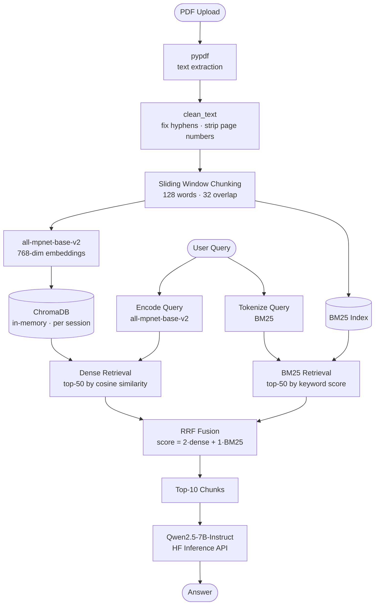
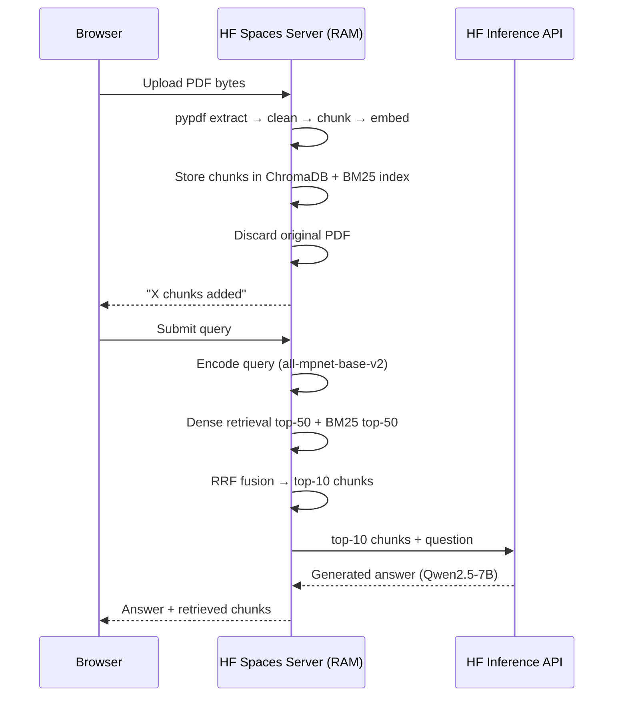

# Document RAG — Hybrid Dense + BM25 Retrieval

Upload any PDF and ask questions. Uses hybrid retrieval (dense + BM25 with Reciprocal Rank Fusion) for 91.7% Recall@10 across 60 benchmark questions spanning 15 papers and 6 domains.

## Architecture



> **Privacy:** PDFs are never stored on disk. Text is extracted server-side, chunked and embedded into RAM, then the original file is discarded. All session data (chunks, embeddings, BM25 index) lives in server memory and is wiped when the session ends.

### Browser ↔ Server Flow



## Eval Results (60 questions, 15 papers, 6 domains)

| Metric | Hybrid RRF | BM25 baseline |
|---|---|---|
| Recall@10 | **91.7% (55/60)** | 68.3% (41/60) |
| Outperforms BM25 by | **+34%** | — |
| Avg warm latency | **34ms** | <1ms |

## Accuracy Journey

| Step | Change | Accuracy |
|---|---|---|
| Baseline | SciBERT CLS embeddings | 0% |
| Swap model | all-MiniLM-L6-v2 | 55% |
| Better model | all-mpnet-base-v2 | 65% |
| Smaller chunks | 200 → 128 tokens | 70% |
| Hybrid RRF (1:1) | dense + BM25 fusion | 85% |
| Weighted RRF (2:1) | dense 2x weight | 90% |
| Universal chunker | remove title heuristic | **91.7%** |

## Models

- **Embeddings**: `all-mpnet-base-v2` (sentence-transformers) — 768-dim, retrieval-optimized
- **Generation**: `Qwen/Qwen2.5-7B-Instruct` via HF Inference API
- **Vector store**: ChromaDB (in-memory per session for frontend, persistent for eval pipeline)

## Setup

```bash
python -m venv venv
source venv/bin/activate
pip install -r requirements.txt
```

## Running

```bash
# Gradio app (deployed on HF Spaces, or run locally)
python app.py

# Streamlit app (local development)
streamlit run front.py

# Eval pipeline (requires papers/ directory and FastAPI running)
uvicorn main:app --host 127.0.0.1 --port 8000
python ingest.py --fresh
python eval.py
```

## Files

| File | Purpose |
|---|---|
| `app.py` | Gradio app — HF Spaces deployment, per-session upload + hybrid search + generation |
| `front.py` | Streamlit app — local development and testing |
| `main.py` | FastAPI backend — `/store` and `/query` endpoints |
| `ingest.py` | Batch ingest papers into persistent ChromaDB for eval |
| `eval.py` | Recall@10 evaluation: hybrid RRF vs BM25 baseline |
| `eval_llm.py` | End-to-end eval: retrieval → generation → cosine similarity |
| `embedding.py` | all-mpnet-base-v2 encode wrapper |
| `chunking.py` | Universal sliding window chunker |
| `cleaners.py` | PDF text cleaning (hyphen breaks, page numbers, whitespace) |
